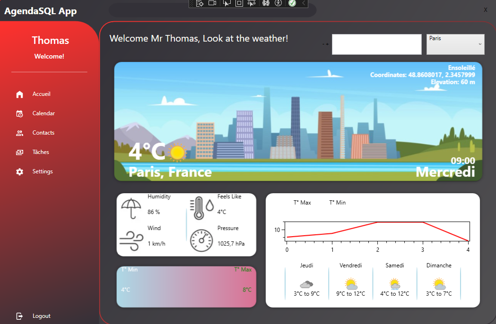

# Agenda App



Welcome to **Agenda App**, a powerful tool designed to keep your life organized and on track. With this app, you can manage your tasks, stay updated with the weather, and seamlessly integrate your Google Calendar. Get started today and take control of your schedule!

## Features
- **Google Calendar Integration**: Check your schedule directly from the app.
- **To-Do Lists**: Create, edit, and manage your tasks efficiently.
- **Weather Updates**: Stay informed with real-time weather information.
- **Database Configuration**: Customize and configure your database to suit your needs.

## Setup Instructions
1. Clone or download the project repository.
2. Configure your database:
   - Find the database structure in the `Agenda_DB` folder.
   - Use the following command in the terminal to scaffold the database:
     ```bash
     Scaffold-DbContext "server=servername;port=3306;user=admin;password=*****;database=db_name" Pomelo.EntityFrameworkCore.MySql -OutputDir Agenda_db -f
     ```
     Replace `servername` and `db_name` with your database details.
3. Check the `Ressources/App.config` file for login credentials:
   - **Login**: `Thomas`
   - **Password**: `1234`

## Getting Started
Once the setup is complete, launch the app to:
- Connect your Google account and sync your calendar.
- Create and manage your to-do lists effortlessly.
- Access real-time weather updates for your location.

## Feedback and Support
If you encounter any issues or have suggestions to improve the app, feel free to reach out. Your feedback is invaluable!

Thank you for choosing Agenda App to organize your life!
